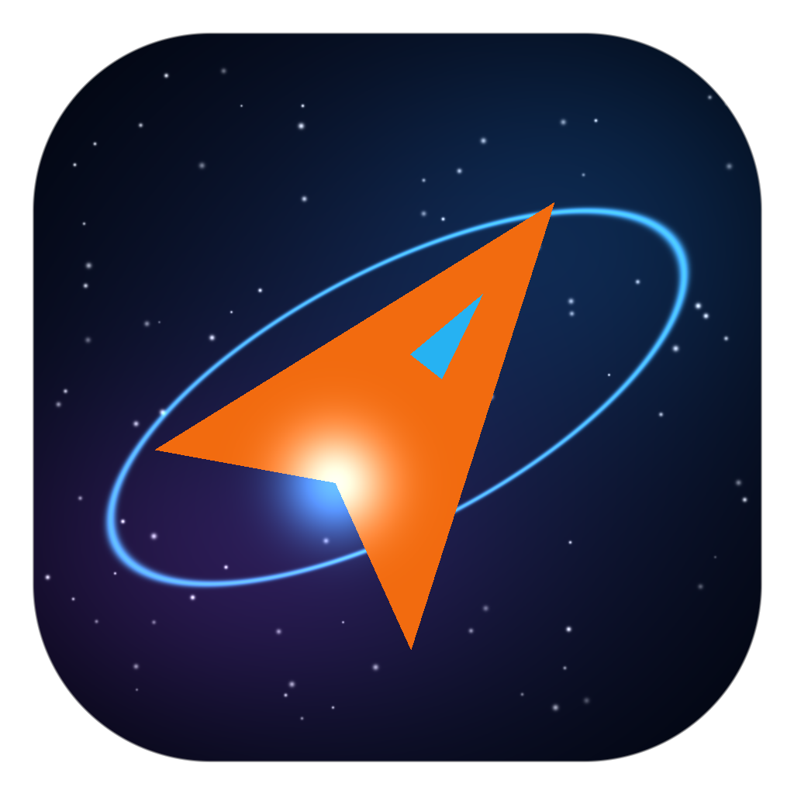
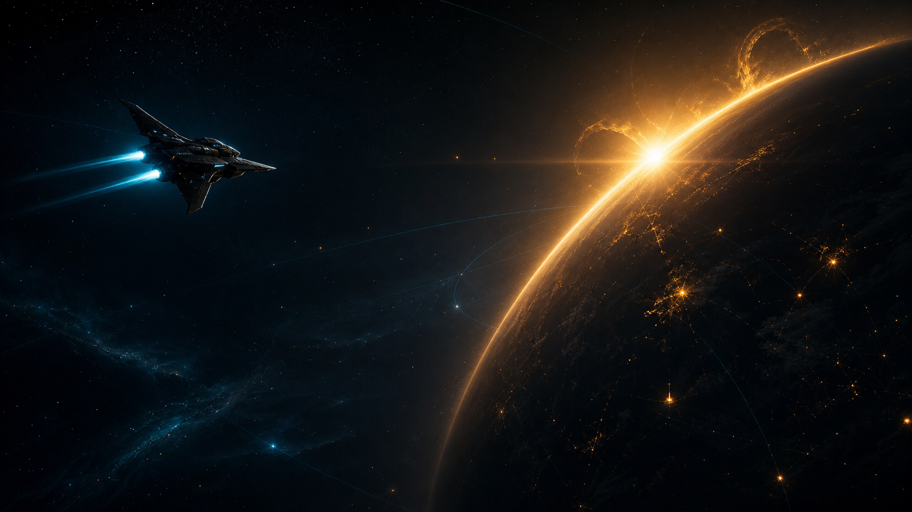
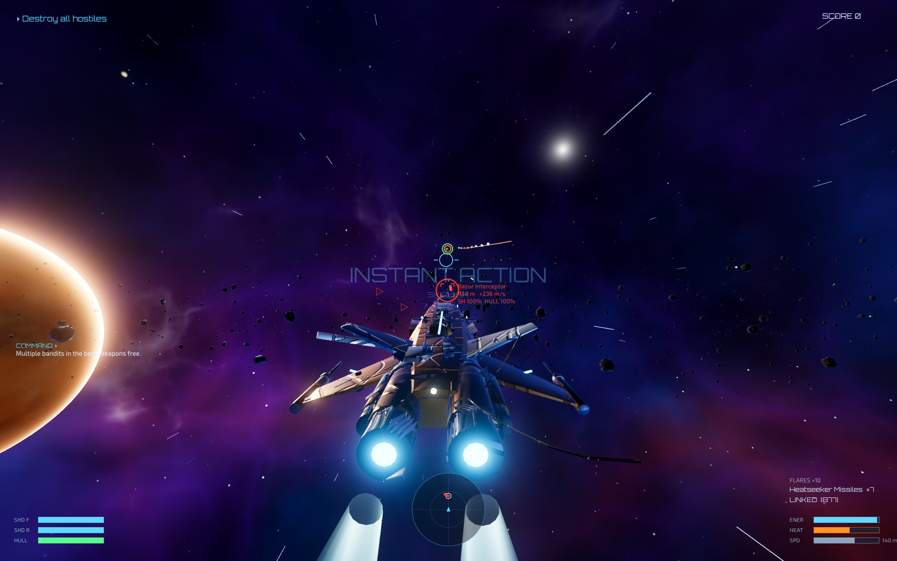
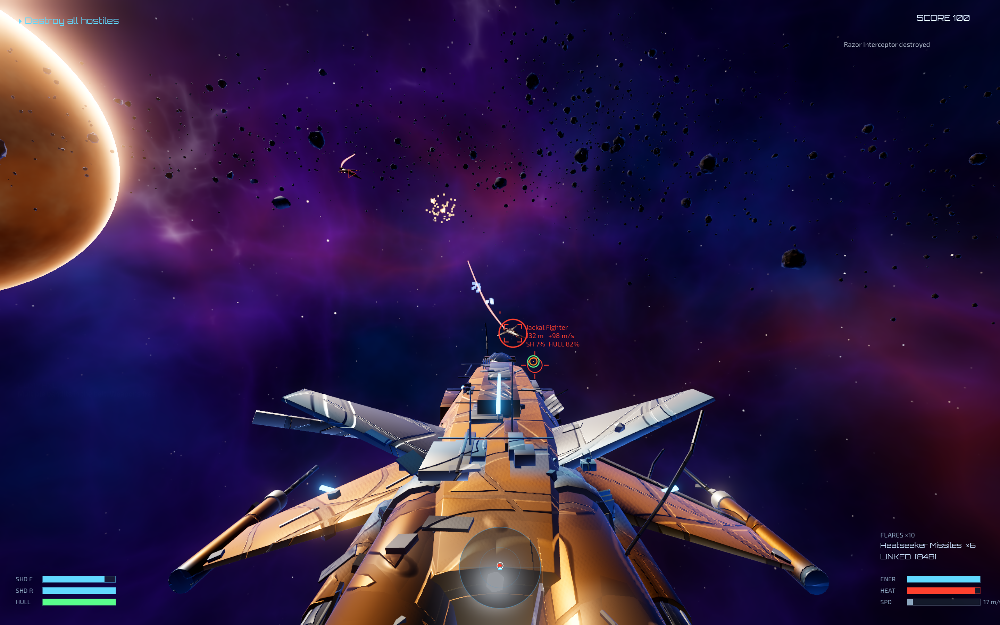
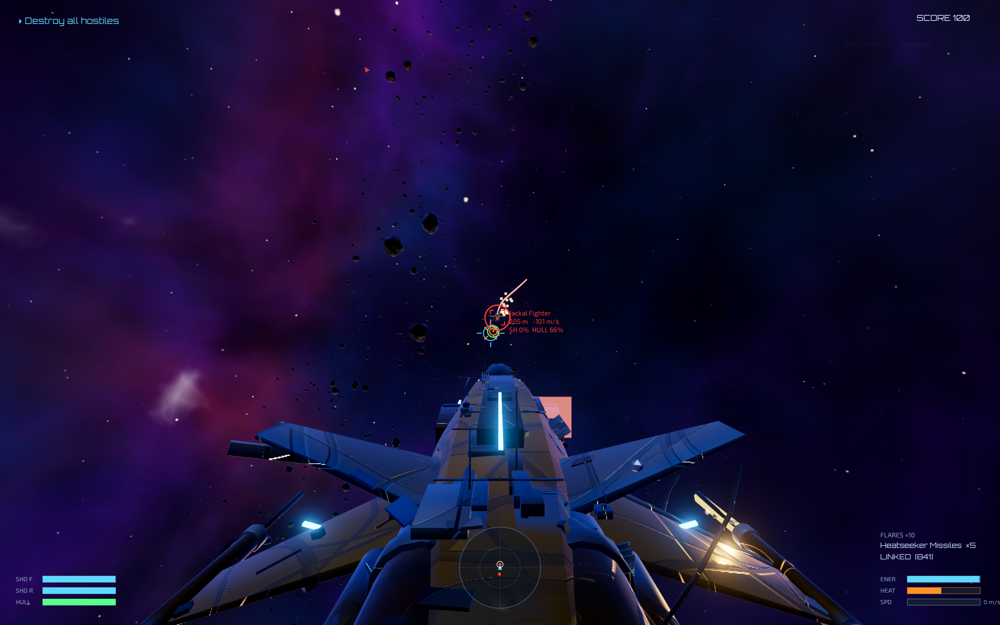
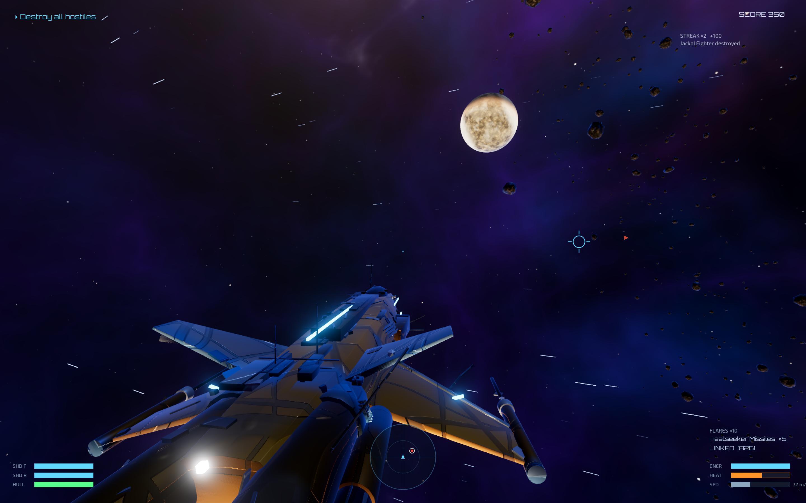
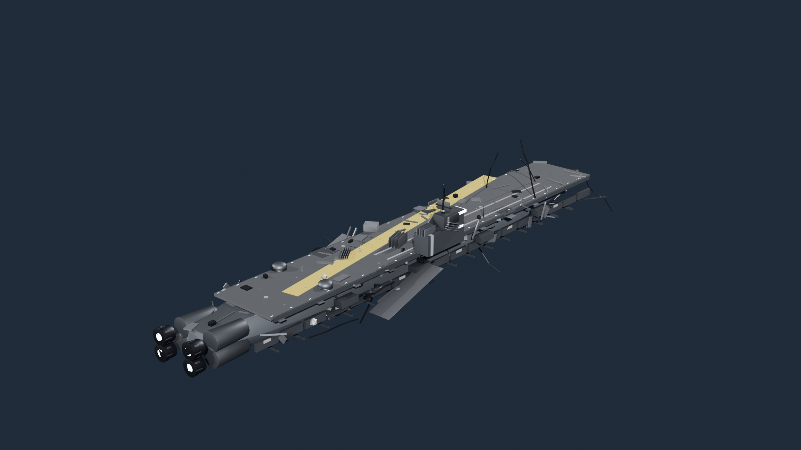
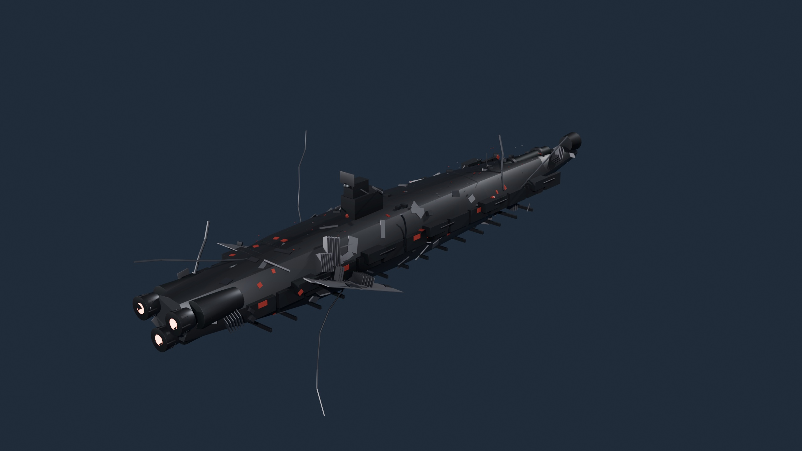
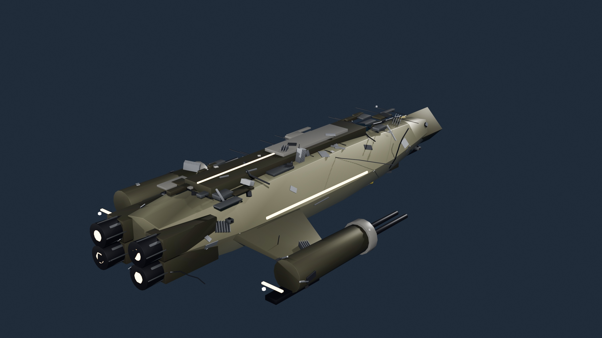

<div align="center">



```text
██╗  ██╗███████╗██╗     ██╗ ██████╗ ███╗   ██╗
██║  ██║██╔════╝██║     ██║██╔═══██╗████╗  ██║
███████║█████╗  ██║     ██║██║   ██║██╔██╗ ██║
██╔══██║██╔══╝  ██║     ██║██║   ██║██║╚██╗██║
██║  ██║███████╗███████╗██║╚██████╔╝██║ ╚████║
╚═╝  ╚═╝╚══════╝╚══════╝╚═╝ ╚═════╝ ╚═╝  ╚═══╝
                  V A N G U A R D
        ── FLY HARD · STRIKE FIRST · SURVIVE ──
```

### Fast, colourful third-person space combat for macOS

Pilot four purpose-built starfighters, master a deep combat sandbox and lead the charge across nine handcrafted operations.

[](https://github.com/Bithisarea2010/Helion-Vanguard/releases/latest)
[](https://godotengine.org/)
[](https://github.com/Bithisarea2010/Helion-Vanguard/releases/latest)
[](LICENSE)

[Download for macOS](https://github.com/Bithisarea2010/Helion-Vanguard/releases/latest) · [Controls](#flight-controls) · [Build from source](#build-from-source) · [Documentation](#engineering-notes)

</div>



> **The belt is alive. Your target is moving. Your reactor is hot.**
> Break formation, acquire lock and turn the void into a battlefield.

## Enter the battlespace

Helion Vanguard is an original, performance-conscious space-combat game built with Godot 4.7, Blender and a procedural asset pipeline. Its controls are immediately readable, but the combat model leaves room to grow: directional shields, heat and energy management, target-leading, velocity matching, countermeasures, missile locks and optional momentum flight all matter once the sky fills with hostiles.

- **Instant Action** — launch directly into an asteroid-belt dogfight.
- **Nine operations** — progress from Flight Academy to the 15–20 minute campaign strike *Operation Sunfall*.
- **Six unlocked player ships** — choose agility, versatility, armor, stealth or long-range missile dominance from the first launch.
- **Advanced capabilities** — lightspeed drive, geodesic shield impacts, adaptive targeting and an expanded arsenal.
- **Layered combat systems** — directional shields, armor penetration, ricochets, heat, energy, ammunition and flares.
- **Living battlefields** — enemy formations, coordinated attack runs, destructible capital-ship subsystems and dense procedural asteroid belts.
- **Full pilot setup** — remappable keyboard, mouse, trackpad and gamepad controls; fullscreen, render-scale and quality options.
- **Photo and tactical modes** — frame the battle or step back and read the entire engagement.

## Combat gallery

<table>
  <tr>
    <td width="50%"></td>
    <td width="50%"></td>
  </tr>
  <tr>
    <td align="center"><sub><b>ACQUIRE</b> — read velocity, shields and hull state</sub></td>
    <td align="center"><sub><b>ENGAGE</b> — guns, missiles, heat and energy in motion</sub></td>
  </tr>
  <tr>
    <td width="50%"></td>
    <td width="50%"></td>
  </tr>
  <tr>
    <td align="center"><sub><b>PURSUE</b> — lead the target through a three-dimensional battlespace</sub></td>
    <td align="center"><sub><b>SURVIVE</b> — fight among moons, nebulae and thousands of rocks</sub></td>
  </tr>
</table>

<div align="center">

### Fleet intelligence

</div>

<table>
  <tr>
    <td width="33%"></td>
    <td width="33%"></td>
    <td width="33%"></td>
  </tr>
  <tr>
    <td align="center"><b>LEVIATHAN</b><br><sub>Supercarrier</sub></td>
    <td align="center"><b>SOVEREIGN</b><br><sub>Dreadnought</sub></td>
    <td align="center"><b>PALADIN</b><br><sub>Gunship</sub></td>
  </tr>
</table>

## Choose your fighter

| Craft | Role | Combat identity |
|:--|:--|:--|
| **SF-3 Wasp** | Interceptor | Fastest and most agile; lethal in skilled hands, unforgiving under fire. |
| **SF-7 Vanguard** | Assault fighter | Balanced speed, durability and firepower—the fleet's dependable all-rounder. |
| **SG-9 Hammer** | Heavy gunship | Slow, armored and built to deliver a brutal broadside. |
| **SM-5 Raptor** | Strike craft | Eighteen missiles and long-range locks for deliberate stand-off attacks. |
| **SR-2 Specter** | Stealth interceptor | Fast, low-signature hunter that delays enemy target acquisition. |
| **SA-11 Paladin** | Assault gunship | Four engines, heavy armor and six racks for direct fleet assaults. |

All six craft are immediately available. Configure weapons, ordnance, paint and engine glow in the Hangar. Fourteen primary weapon systems and eight ordnance classes support everything from precision railgun passes to saturation attacks.

## Download and play

1. Open the [latest GitHub release](https://github.com/Bithisarea2010/Helion-Vanguard/releases/latest).
2. Download the latest **Helion Vanguard macOS ZIP**.
3. Extract the ZIP and open **Helion Vanguard.app**.
4. If macOS blocks the first launch, Control-click the app and choose **Open**.

The current build is ad-hoc signed but not Apple-notarized. See [the build guide](docs/BUILD.md#code-signing-status) for Gatekeeper details and checksum information in the release notes.

## Flight controls

| Input | Action | Input | Action |
|:--|:--|:--|:--|
| Mouse / trackpad | Aim | **W / S** | Thrust / brake and reverse |
| **A / D** | Strafe | **Q / E** | Roll |
| **Space / Left Ctrl** | Move up / down | **Left Shift** | Boost |
| Left mouse | Fire primary | Right mouse | Fire missile |
| **R / T** | Cycle / crosshair target | **X** | Match target velocity |
| **G** | Countermeasure flares | **V** | Weapon group |
| **C** | Cycle camera | **B** | Tactical map |
| **M** | Toggle flight assist | **P** | Photo mode |
| **Esc** | Pause | Gamepad | Fully mapped |

Every binding can be changed under **Settings → Controls**. The game releases mouse capture automatically in menus, when paused and when focus is lost.

## Built as a complete pipeline

```text
       BLENDER GENERATORS                 GODOT 4.7
  ┌────────────────────────┐       ┌─────────────────────────┐
  │ ships · fleets · props │──────▶│ scenes · AI · missions │
  │ greebles · vertex AO   │       │ combat · HUD · shaders │
  └────────────────────────┘       └────────────┬────────────┘
                                                │
  ┌────────────────────────┐                    ▼
  │ Python audio synthesis │──────▶  macOS application + ZIP
  │ icon and asset tooling │          verified release build
  └────────────────────────┘
```

The repository includes the gameplay source, procedural Blender generators, original models, synthesized sound effects and loops, the documented project-owner-supplied playlist, shaders, mission logic, test hooks and performance documentation. Scene stubs stay small because much of the game is assembled in code.

<details>
<summary><b>Repository map</b></summary>

```text
project.godot          Godot 4.7 project entry point
scenes/                Scene stubs and test scenes
scripts/               GDScript gameplay, UI, AI and systems
shaders/               Hull, sky, planet and effects shaders
assets/                Models, audio, fonts, icons and textures
blender_src/           Procedural generators and Blender sources
tools/                 Audio synthesis and icon generation
tests/                 Runtime and deterministic effect probes
docs/                  Build, controls, performance and audit notes
```

</details>

## Build from source

Requirements: **Godot 4.7 stable**, macOS 11 or newer, and the matching Godot export templates.

```sh
/Applications/Godot.app/Contents/MacOS/Godot --headless --path . --import
mkdir -p build
/Applications/Godot.app/Contents/MacOS/Godot --headless --path . \
  --export-release "macOS" "build/Helion Vanguard.zip"
```

For signing, installation, asset regeneration and the automated combat harness, read [docs/BUILD.md](docs/BUILD.md).

## Engineering notes

| Document | What it covers |
|:--|:--|
| [Build guide](docs/BUILD.md) | Export, signing, automated runs and asset regeneration |
| [Controls and features](docs/CONTROLS_FEATURES.md) | Tested controls, game systems and macOS behavior |
| [Performance](docs/PERFORMANCE.md) | Rendering presets, measurements and optimization notes |
| [120-fix ledger](docs/FIXES_120.md) | Concrete quality and stabilization work |
| [Limitations](docs/LIMITATIONS.md) | Current boundaries and known constraints |
| [Licenses and attribution](LICENSES.md) | Original work and third-party notices |

## License

The repository includes an [MIT license](LICENSE). Third-party fonts and CC0 texture sources remain under their respective licenses and are documented in [LICENSES.md](LICENSES.md) and [`assets/manifest.json`](assets/manifest.json).

---

<div align="center">

```text
         .       *        .       +       .
    *        ────────[ HELION CONTROL ]────────
         VECTOR LOCKED  ·  WEAPONS FREE
    .        +        *       .        *
```

**Built with Godot, Blender, procedural tools and an unreasonable affection for glowing engines.**

[Download latest release](https://github.com/Bithisarea2010/Helion-Vanguard/releases/latest) · [Report an issue](https://github.com/Bithisarea2010/Helion-Vanguard/issues)

</div>
