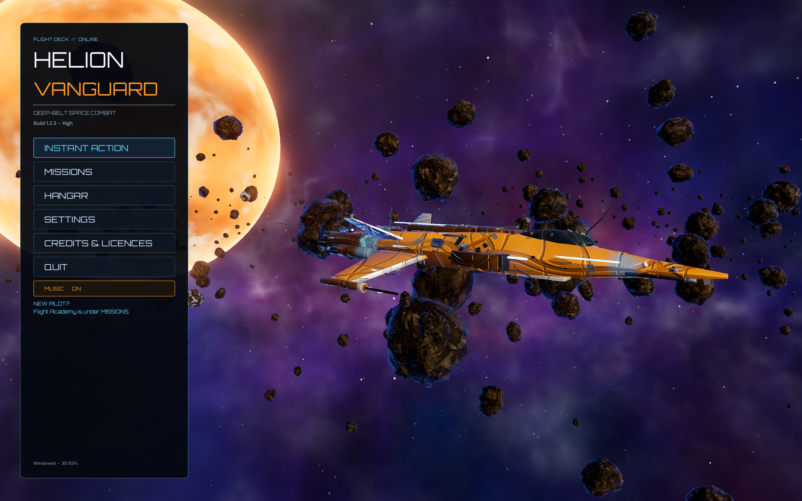
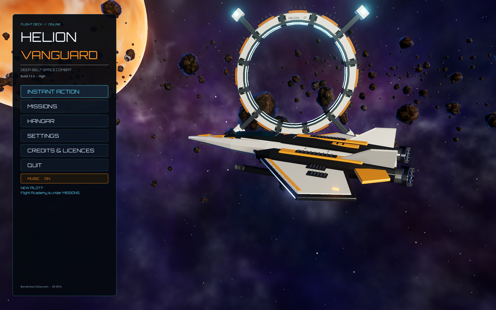
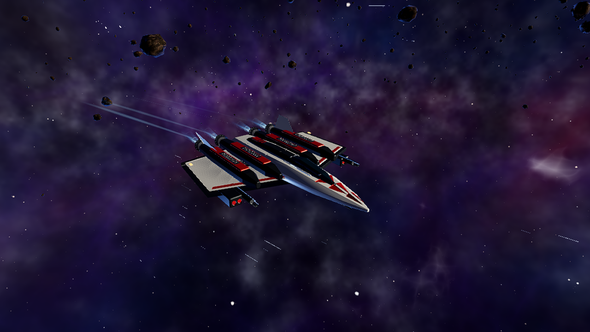

# Helion Vanguard 1.3.0 — quality production report

13 September 2026. Local production branch: `codex/quality-production-2026-09-13`.
Authoritative root: `/Users/bokkonboldiszar/Desktop/Codex Workspace/05_SHARED_PROJECTS/Games/HelionVanguard`.

## Executive result

The existing Godot space-combat game now has a redesigned Vanguard, two additional
playable ships, a navigable authored relay, a more legible combat interface,
shorter optional transitions, better survival sustain and training behavior,
comfort settings, and an original weapon/impact/reward/ambience sound palette.
The fleet has expanded from six to eight selectable hulls. All ten existing
mission modes remain available.

This is a tested improvement to an in-development game. It is not a claim of
Unreal Engine 5 visual parity, photorealism, a finished retail campaign, or
universal hardware performance. The visual target is readable stylized space
combat: ivory ceramic, dark metal, restrained amber/cyan markings and a violet
stellar environment. The actual Godot captures below are the visual evidence;
separate Blender studio renders are asset-review images only.

## Initial inspection and recovery

- Initial Git branch: `agent/restore-classic-readme`, source commit `52d1322`.
  Remote configured locally: `https://github.com/Bithisarea2010/Helion-Vanguard.git`.
  The existing local project was authoritative, so no clone or remote upload was
  necessary. GitHub content was not fetched or used as completion evidence.
- Existing local MCP additions were checkpointed as `891f267` before substantive
  changes. The local `.mcp.json` remains untracked and unmodified. Existing branches,
  saves and other projects were preserved. Git provides recovery without a second
  project-folder copy.
- Installed runtime: Godot `4.7.2.stable.official.ed1daf0bf`, Metal Forward+.
  Blender `5.2.0 LTS` was used in isolated background processes for mesh creation,
  glTF export and rendering. The Blender bridge was unavailable with Blender
  closed; the lean Godot bridge was reachable but not connected to the project.
  The project's NPGameDev toolkit was used where available, with engine CLI and
  real rendered runs as the reliable validation path. No new plugin was installed.
- Baseline: 182 regression checks passed. Import returned success but the local
  toolkit emitted a macOS PID-registry error. The original `--windowed` launch
  still rendered at 2880×1800, and earlier benchmark counters used engine delta.
- The initial priorities were launch/test isolation, HUD readability, environment
  composition, encounter sustain and audio. The user's subsequent ship-design
  request added the authored three-hull pass. The final pass was bounded to fixes,
  measurements, package validation and storage cleanup.

## Detailed changelog

### Graphics, atmosphere and materials

- Rebuilt the Vanguard's visible hull with modeled armor plates, bevels, cockpit,
  engine assemblies, radiators, weapon housings and identification markings.
  Added Peregrine and Aegis to the same design family.
- New hulls use their authored detail with a restrained shader profile. Legacy
  hulls retain procedural detail with reduced seam distortion and contrast.
  Paint, engine colors and progressive battle damage still work through the
  existing shared material system.
- Reduced competing nebula/galaxy brightness and saturation, adjusted planet
  exposure, and moved the menu's foreground asteroid cluster to improve subject
  separation. Existing Forward+ lighting, reflections, shadows, glow, PBR rocks,
  procedural sky and quality presets remain in use.
- Added Relay 07: an ivory/titanium/copper orbital structure with luminous inner
  guidance bands, four pylons and service/radiator modules. It appears in the
  menu and in missions, where it provides a recognizable spatial objective.
- Kept VFX intensity scalable. Added flash-intensity control to damage and
  transitions; preserved existing trails, weapon effects, shields, wrecks and
  explosions. Fixed delayed-effect lifetime errors during scene changes.

### Gameplay, ships and encounters

| Ship | Role | Flight/combat distinction |
|---|---|---|
| SF-7 Vanguard | Assault fighter | Existing balance retained; new hull and corrected weapon/engine attachment locations |
| SF-12 Peregrine | Precision interceptor | Speed 148, hull 90, shield 82; railgun/ion loadout, fast attack and exit |
| SA-14 Aegis | Escort strike fighter | Speed 110, hull 205, shield 150; four engines, plasma/autocannon and radar missiles |

- All eight ships are unlocked, including for migrated saves. Existing loadouts,
  paint options and weapons remain available.
- Relay fly-throughs use swept-path plane intersection, so a fast ship cannot
  skip the trigger. A clean pass awards +150 score and +25 energy once per mission.
  Armor has physical collision; the center aperture is genuinely open. Nearby
  asteroids and the initial player position receive reserved clearance.
- Survival waits for a cleared wave before advancing. Between waves it supplies
  30% of ballistic capacity, two missiles/countermeasures and 12% hull repair,
  all clamped to capacity. The existing wave score reward is retained.
- Arena ammunition is replenished without removing heat, lock or cooldown rules.
- Every staggered training drone stays passive; previously only the formation
  leader reliably received the practice configuration. Training guidance uses
  the actual input bindings.
- Burning death-spiral enemies immediately leave target selection and release
  their attack allocation, while their visible destruction still completes.
- Pause suspends camera motion. Photo mode now enters and exits reliably from
  the cockpit, revealing/restoring the exterior hull correctly.

### UI, UX and accessibility

- Reorganized HUD into bounded objective, comms, flight, weapon and target panels,
  with high-contrast backing, separate radar and readable numeric state. Text
  truncates or wraps within its area instead of extending across combat.
- Added kill confirmation, a relay world label and brief input-aware flight hints.
  Target information is placed away from the central aiming area.
- Hangar selection uses a four-column/two-row grid for all eight ships.
- Pause gives keyboard/controller focus to Resume. Existing remapping, sensitivity,
  audio levels and controller bindings are preserved.
- Added FOV-motion, flash-intensity and HUD-scale settings, a flight-hint toggle
  and a quick-transition option. Zero camera shake also removes cockpit vibration.
- Quick transitions retain real loading checks but reduce artificial minimum waits
  from 7–9 seconds to 0.45 seconds for transitions and 1.2 seconds for boot.
  The original cinematic presentation can still be selected.
- Warm High mission transitions in the integration run took roughly 1.0–1.5 seconds.
  A cold Ultra renderer load exposed the old 35-second timeout: initialization
  milestones now permit a bounded grace period, never exceeding 120 seconds.
  Missing scenes still fail at the normal deadline.

### Audio

- Nine original mono 44.1 kHz/16-bit WAV assets: pulse, autocannon, rail, plasma,
  shield impact, armor impact, relay transit, wave resupply and a 16-second
  looping reactor/flight bed. The generator preserves the older bank and playlist.
- Weapon families now have distinct attack/body/tail signatures. Player impacts
  distinguish shields from armor; rewards use related short musical motifs.
- A dedicated Ambience bus and slider control flight-deck sound independently.
  Its level blends between flight, menu and pause states.
- SFX compression controls overlapping impacts; a master limiter provides output
  headroom. Music ducks during radio comms and pause without changing user gains.
  Critical warnings reserve a voice, and repeated cues have short cooldowns.
- Positional one-shots outside the camera's audible range are discarded before
  taking a voice. The bounded 12-interface/32-spatial voice pools remain intact.
- Generated samples contain **zero clipped samples**. The rendered integration
  run measured a **−1.92 dBFS** master peak. These are signal measurements, not a
  claim of listening-room calibration or subjective headphone testing.

### Assets and pipeline

| Asset | Triangles | Material batches | Source |
|---|---:|---:|---|
| Vanguard Mk III | 22,560 | 8 | `blender_src/hero_fleet.py` |
| Peregrine | 22,456 | 8 | `blender_src/hero_fleet.py` |
| Aegis | 32,552 | 8 | `blender_src/hero_fleet.py` |
| Relay 07 | 9,716 | 6 | `blender_src/relay_foundry.py` |

Meshes are exported as GLB with merged material groups and UVs. Editable `.blend`
sources are retained. The new sound generator is `tools/quality_audio.py`.
The game pack excludes Blender sources, tools, tests, docs, captures, the editor
MCP add-on and local MCP configuration.

No external asset or plugin was added. Original asset provenance, exact file
usage and the licenses of the existing tools are recorded in
[LICENSES.md](../LICENSES.md) and [assets/manifest.json](../assets/manifest.json).
Godot is MIT; Blender is GPL and is only used as an authoring tool; its output
is not bundled with Blender itself. NumPy's BSD-licensed bundled runtime is
used for synthesis and is not distributed with the game.

### Stability and maintainability

- Fixed macOS window-mode timing so `--windowed` reliably produces a 1280×720
  drawable. Kept project settings changes to version and initial window mode.
- `--defaults` now isolates both settings and saves. Test runs cannot overwrite
  campaign state. Added explicit RNG seeding for reproducible scenarios.
- Benchmark frame measurements now use elapsed wall time. Captures are measured
  separately because GPU readback/PNG writing creates artificial stalls.
- Removed invalid references when projectiles outlive their shooter, and when
  delayed explosion/wreck callbacks outlive their scene.
- The existing toolkit skips transient headless editor registration, avoiding
  the initial macOS PID-registry error without removing the user's editor setup.
- Added regression coverage for settings/comfort, resupply limits, target lifetime,
  photo visibility, imported hulls, audio muting/stream isolation, and bounded
  loading grace. A rendered integration probe covers actual scene/input behavior.

## Validation evidence

| Gate | Result | Evidence |
|---|---|---|
| Final engine import/script compilation | Exit 0; no engine errors or warnings | `after/import-final.log` |
| Deterministic regression suite | **240 passed, 0 failed**, exit 0 | `after/regression-final.log` |
| Rendered integration suite | **63 passed, 0 failed**, exit 0 | `after/integration-final.log` |
| Existing content | All 10 missions launched with live player/weapons/HUD | integration log |
| Navigation/game feel | Real thrust/fire inputs, relay traversal and collision, pause/photo, practice drones, live survival/arena resupply | integration log |
| Fleet | All three authored hulls import, fly and fire; eight material groups each | integration log, Blender export log |
| Audio | Nine files without clipping; live mix peak −1.92 dBFS | `after/audio-assets.json`, integration log |
| Performance profiles | Native High, windowed Low/High/Ultra and Fleet High completed | `after/perf-*.log` |
| Local package | Export, ad-hoc staging signature check and exact-engine packaging | `after/build.log`, build manifest |
| Package content | Eight checks confirm version/assets/audio and exclusion of MCP/configuration | `after/package-integrity.log` |
| Packaged gameplay | Direct app-binary combat run and captures | `after/package-smoke.log`, `after/package-playtest.log`, `after/package/` |

Evidence paths are relative to `docs/evidence/quality-2026-09-13/`. The integration
suite uses synthetic input events through Godot in a real Metal-rendered window.
It is not a substitute for a human campaign playthrough or hardware-controller QA.
The final bounded-loading change was followed by regression and successful
Ultra/Fleet runtime checks. Failed intermediate issues were fixed before the
final package; the cold-Ultra failure log is retained for diagnosis.

The capture-free packaged smoke run completed all 12 mission seconds at about 60 FPS with default VSync and no engine warnings/errors. The separate screenshot run produced three captures and exited via its bounded watchdog; GPU readbacks delayed mission-clock advancement. It is not included in the performance table. The package-content inspector waits for the first audio mix before shutdown, avoiding a two-object early-exit playback warning found in its first draft.

Final game runs have no GDScript errors. macOS's enabled Metal diagnostic HUD
sometimes prints duplicate-metric and menu-modifier messages; these are host
instrumentation messages. The cold-Ultra timeout warning is retained only in
`after/ultra-cold-start-timeout.log`, not the successful final profile log.

## Performance measurements

Apple M1, 8 GB, Metal Forward+. Uncapped runs; render scale 85%. Native means
2880×1800 output, windowed means 1280×720 output. The virtual UI coordinate
space is 1920×1080 and must not be mistaken for the drawable resolution.

Values below are **medians of one-second buckets**, excluding the first three
mission seconds. The p95 column is the median of each bucket's p95, not an
aggregate whole-run percentile. Worst frame is the maximum within those retained
buckets. Capture-free runs last 25 mission seconds for native and 18 for windowed.

| Scenario | Median FPS | Median bucket p95 | Worst frame | Max reported video memory |
|---|---:|---:|---:|---:|
| Before: Instant Action, High, native | 74.45 | 15.86 ms | 34.59 ms | 625.9 MB |
| After: Instant Action, High, native | 71.35 | 16.02 ms | 35.61 ms | 591.6 MB |
| After: Instant Action, High, 720p | 217.40 | 10.44 ms | 21.46 ms | 271.5 MB |
| After: Instant Action, Low, 720p | 245.50 | 10.50 ms | 36.26 ms | 158.4 MB |
| After: Instant Action, Ultra, 720p | 157.85 | 7.80 ms | 1788.73 ms | 365.6 MB |
| After: Fleet Action, High, 720p | 201.30 | 10.19 ms | 27.20 ms | 288.8 MB |

Native median FPS was about **4.2% lower** after the visual/content additions;
reported video memory was about **5.5% lower**. This is a quality/cost tradeoff,
not evidence of a general FPS optimization. Combat trajectories and effect
counts vary with frame scheduling despite a fixed seed, so the measurements
cannot isolate individual changes. Median native draw calls increased from
166 to 253, and primitives from 72,179 to 87,894; the different encounter state
and new content both contribute.

High remains the default. Ultra is operational but showed a **1.79-second
first-use shader/pipeline hitch** even after loading; this remains a limitation.
The high uncapped 720p averages do not imply an equivalent display refresh rate
or perfectly even frame pacing. Default VSync remains enabled for normal play.
No long thermal soak, GPU capture, battery-life study or cross-machine benchmark
was performed. Data and a reproducible summarizer are in
`after/performance-summary.json` and `tools/summarize_quality_evidence.py`.

## Visual and audio evidence

Before: original main menu, native 2880×1800. This was the existing saved hull;
it is a presentation baseline, not a matched camera/ship comparison.

After: redesigned Vanguard and Relay 07 in the actual packaged Godot main menu, also 2880×1800. Ship selection and camera pose differ from the baseline.

After: Aegis in actual Godot photo mode, captured from the playable mission.

The complete labeled set also contains Vanguard/Peregrine flight and combat,
relay geometry, cockpit, pause, comfort settings, the eight-ship hangar and a
960×540 HUD layout. Files ending `-blender.png` and `relay_blender.png` are
separate offline studio renders. They do not represent Godot rendering quality.

The original-only dry sound palette is `after/sound-palette.wav`; it deliberately
excludes the owner's pre-existing MP3 tracks. Its numeric measurements are in
`after/audio-assets.json`.

## Remaining limitations and opportunities

- The game retains stylized procedural art and simplified flight colliders.
  Five older playable hulls and the enemy/capital fleet have not received the
  new Blender geometry treatment. Authored texture painting, more distinct enemy
  silhouettes and additional environmental stories remain valuable future work.
- The two new ships have functional distinct roles, but long-form balance,
  economy/rewards and every mission's victory/failure path were not exhaustively
  tested. No missions were removed.
- Ultra first-use pipeline compilation can still hitch. The loading grace
  prevents the observed premature fault but does not eliminate compilation cost.
- HUD layout was captured at 960×540 and 1280×720; 1280×720 or larger is preferable
  for text readability. Physical controllers, ultrawide screens, alternate
  keyboard layouts and broad accessibility user testing remain unverified.
- The audio palette was checked by file analysis and live engine meters. It still
  needs subjective mix review on speakers/headphones and a broader set of hardware.
- Existing owner-provided MP3 redistribution rights remain unverified. This is a
  local build; nothing was published. No new unlicensed audio was introduced.
- The app is Apple Silicon only, locally ad-hoc signed, not notarized. It uses the
  exact installed engine runtime because matching 4.7.2 export templates were
  unavailable. Standard release-template builds and other platforms remain work.
- Desktop FileProvider may add FinderInfo after copying the app, making strict
  signature reinspection complain about metadata. The build script verifies in
  clean staging, and direct packaged gameplay is separately tested after copying.

## Open and run

Open `project.godot` at the authoritative root in Godot **4.7.2**, then press F5.
Or open `build/quality-1.3.0/Helion Vanguard.app` for the self-contained local build.
Choose HANGAR for all eight ships, INSTANT ACTION for combat, or MISSIONS → Flight
Academy for training. Default controls: W/S thrust/brake, mouse steering, LMB
primary, RMB secondary, R target, Shift boost, C camera, P photo, Esc pause.

Full build, asset-generation and bounded verification commands are in
[BUILD.md](BUILD.md). The builder's `--replace` flag only replaces its recognized
1.3.0 output after the new staged build passes its checks.

## Storage and final recovery state

Removed **347.1 MiB of allocated obsolete output**, including the verified old
1.2.3 `build/all-ships-release` app/ZIP (about 318 MiB), intermediate captures and
this task's Python bytecode. Removal occurred only after the replacement's
content and direct gameplay checks passed. The current self-contained build is
about **215 MiB**, with no second ZIP or copied project backup retained.

The old release/current release size difference is about **103 MiB**. This is
not a claim that total SSD free space increased by 347 MiB: the new build, assets,
Git objects and retained evidence also occupy space. Filesystem-wide usage can
change due to other applications. Exact removed paths and allocated-byte counts
are in `after/storage-cleanup.json`.

Kept current editable assets, current app, one baseline/final evidence set, Git
history and the small initial checkpoint. Other projects, user saves, applications,
shared caches and local MCP data were not removed. Machine-local `.mcp.json` and
Python bytecode are now Git-ignored to keep accidental additions out of commits.
